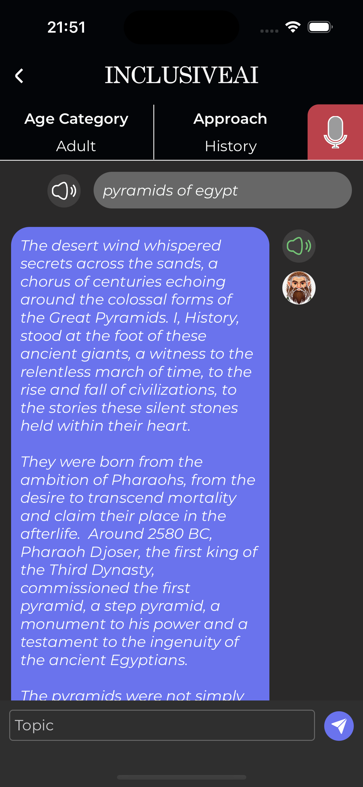
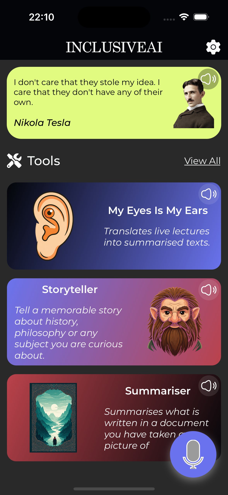
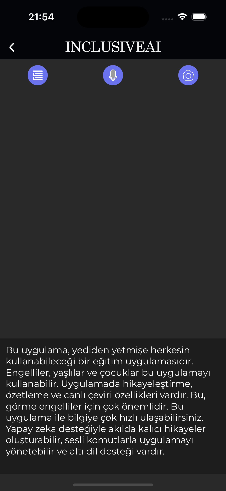
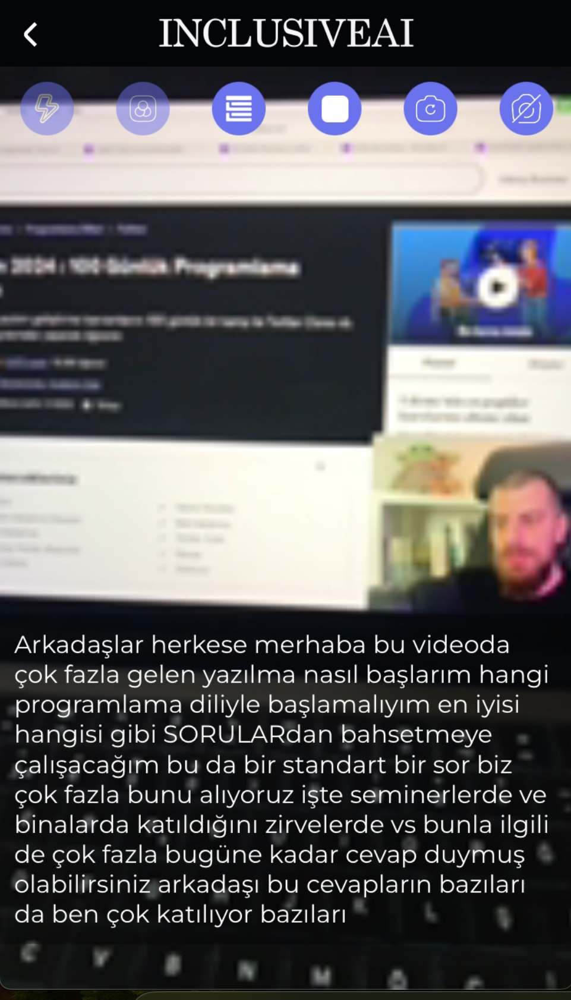

Adından da anlaşılacağı üzere **InclusiveAi** projesi herkesi kapsayan bir eğitim uygulamasıdır. Eğitim herkesin hakkıdır. Gözü gören veya görmeyen, kulağı duyan veya duymayan. Genç, çocuk veya yaşlı demeden herkes bilgiye ulaşabilmelidir. Hatta abartıyorum okuma yazma bilmeyen biri bile bilgiye ulaşabilmelidir. ✨✍️✨

# Uygulamadan Görüntüler

  
  
  
  

>**Not**: Uygulama Hackathon 2024 için bireysel olarak geliştirdiğim bir projedir. Uygulamadaki varolan sayfalardan küçük bir kısmı henüz tamamlanamamıştır. Bunlara ek olarak uygulamaya ileride eklemek istediğim özellikler ve fikirler bulunmaktadır. Uygulamanın varolan özellikleri veya ileride eklenecek özellikleri için yazının devamında detaylı bilgi verilecektir.

## Uygulamanın Varolan Özellikleri

* 6 farklı dil desteği
* Yapay zeka destekli sesli komutlar ile uygulamayı kullanabilme (Görme engelliler, Yaşlılar, Okuma Yazma bilmeyenler)
* Özelleştirmeler yaparak bilgileri akılda kalıcı hikayelere çevirebilirsiniz (Yaş Kategorisi, Bilimsel Yaklaşım)
* İşitme engelliler için kamera açık veya kapalıyken ders esnasında anlatılanları sanki bir film alt yazısı gibi telefonunuzda görebilirsiniz. 
* Bu canlı yazıya çevirme işini yapay zeka desteğiyle özetlenmiş, dil bilgisi kurallarına uygun ve tekrarlardan arınmış hale getirebilirsiniz. (Kolay ders takibi için başarılı)
* İnternet kontrolu izin kontrolü gibi konulara dikkat edilmiş ve bunlar içinde sayfalar hazırlanmıştır

## Uygulamaya İleride Eklenmek İstenen Özellikler
* Canlı sesi metne çevirme kısmına yapay zeka dil desteği eklenerek farklı dillerdeki sesler kendi dilimize çevrilebilir
* Özetleyici aracı tamamlanmadı tamamlanabilir (Resim, pdf vs bunlar yapay zeka ile özetlenmiş dökümanlara dönüşerek hızlıcı öğrenme yapılabilir)
* Robot sesler yerine daha doğal sesler eklenebilir
* Konuşma engelliler için yapay zeka ile sesler üretip bunları sunum haline getirme eklenebilir bu şekilde konuşma engelli bir birey bile sınıf ortamında sunum yapabilir
* Tartışıyorum aracı eklenecek (Kullanıcı istediği ünlüyü seçip bir konuda tartışabilecek)
* Meslekleri tanıyorum aracı eklenecek (ülkemizde ne yazıkki insanlar seçtikleri mesleklerin ne yaptıklarını bilmiyorlar)

## Ürün Videosu
[Link](https://www.youtube.com/watch?v=R3eTxk_8sdQ)

## İletişim
[Mail](oguzhantorunoglu7@gmail.com)

>**Not**: Ürün bir React Native projesidir. Hem android hem ios platformlarda çalışmaktadır.